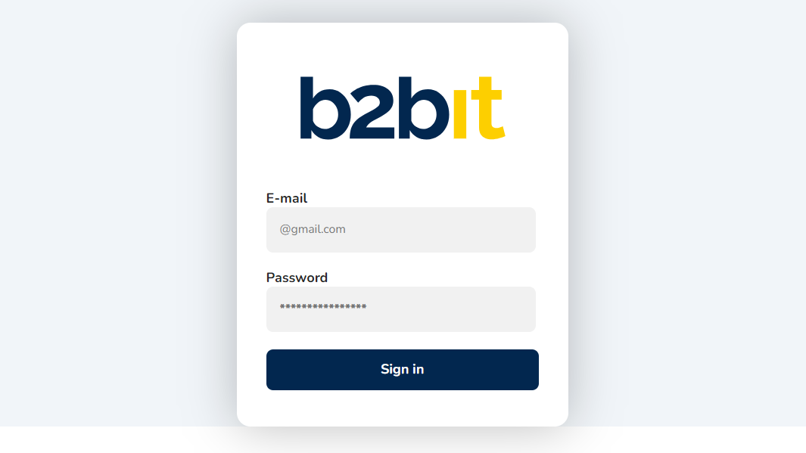

# Desafio B2BIT

## Descrição:
Projeto desenvolvido para desafio na empresa B2BIT, para vaga de desenvolvedor Frontend.

## Requisitos:
- NodeJS
  - Instalar NodeJS - <a href="https://nodejs.org/dist/v20.12.2/node-v20.12.2-x64.msi">Baixar!</a>

## Executando projeto
1. Através do GIT clone o repositório do projeto:
    - ```git clone https://github.com/Gabrielrc11/desafio_b2bit.git```
2. Entre na pasta **desafio_b2bit** com o comando:
    - ```cd desafio_b2bit```
3. Execute o seguinte comando para instalar as dependencias do Projeto:
    - ```npm install react-scripts --save-dev```
4. Execute o seguinte comando para rodar o projeto:
    - ```npm start```
> [!NOTE]
> Para parar a execução do projeto use, no terminal, as teclas: ```Ctrl + C e digite a tecla S para confirmar```

### Prévia do projeto
Se tudo tiver dado certo, é assim que você deve vizualizar o projeto em seu navegador no caminho: http://localhost:3000/
<br><br>


## Padronizações
### Commits
Os commits devem seguir o padrão mostrado no site do <a href="https://www.conventionalcommits.org/pt-br/v1.0.0/" target="_blank">Conventional Commits</a>

## Branches
A padronização das **Branches** é parecida com a padronização dos commits, onde o nome da branch precisa ter um ***préfixo*** da seguinte forma:
 - ```feature/name_branch```
Esses **préfixo** podem ser:

| Préfixos  | Descrição |
| ------------- | ------------- |
| feature | Usado na branch que tem o objetivo de adicionar, refatorar ou remover um recurso  |
| bugfix  | Usado na branch que tem o objetivo de corrigir um bug  |
| hotfix  | Usado na branch que tem o objetivo de alterar o código com uma solução temporária e/ou sem seguir o processo normal (geralmente devido a uma emergência)  |
| improvement  | Usado na branch que tem o objetivo criar uma melhoria para algo que já existente, seja de performance, de escrita, de layout, etc. |

# Challenge B2BIT

## Description:
Project developed for a challenge at the company B2BIT, for a Frontend developer position.

## Requirements:
- NodeJS
  - Install NodeJS - <a href="https://nodejs.org/dist/v20.12.2/node-v20.12.2-x64.msi">Download!</a>

## Running project
1. Using GIT, clone the project repository:
    - ```git clone https://github.com/Gabrielrc11/desafio_b2bit.git```
2. Enter the folder **desafio_b2bit** with the command:
    - ```cd desafio_b2bit```
3. Run the following command to install the Project dependencies:
    - ```npm install react-scripts --save-dev```
4. Run the following command to run the project:
    - ```npm start```
> [!NOTE]
> To stop the execution of the project, use the terminal keys: ```Ctrl + C and press the S key to confirm```

### Project preview
If everything went well, this is how you should view the project in your browser on the way: http://localhost:3000/
<br><br>


## Standardizations
### Commits
Commits must follow the pattern shown on the website <a href="https://www.conventionalcommits.org/pt-br/v1.0.0/" target="_blank">Conventional Commits</a>

## Branches
The standardization of **Branches** is similar to the standardization of commits, where the branch name needs to have a ***prefix*** this way:
 - ```feature/name_branch```
Those **prefix** can be:

| Prefix  | Description |
| ------------- | ------------- |
| feature | Used in the branch that has the objective of adding, refactoring or removing a feature  |
| bugfix  | Used in the branch that aims to fix a bug  |
| hotfix  | Used in the branch that aims to change the code with a temporary solution and/or without following the normal process (usually due to an emergency)  |
| improvement  | Used in the branch that aims to create an improvement for something that already exists, be it performance, writing, layout, etc. |
